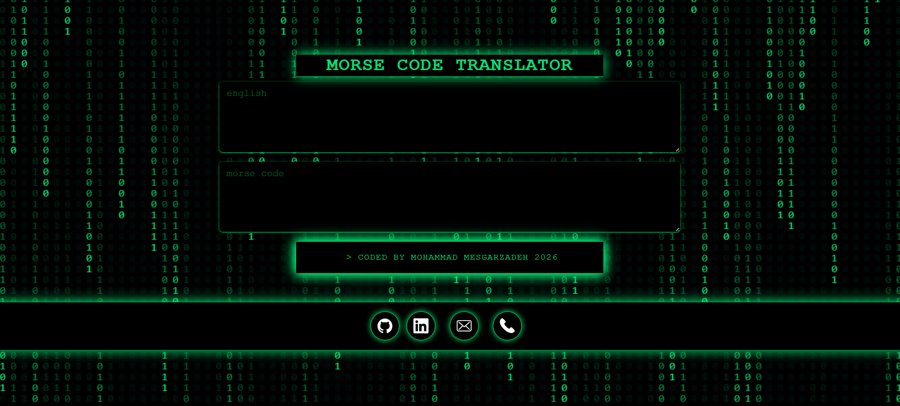

# Morse-code-translator
A modern and practical Morse Code Translator project for converting text into Morse code. This project is developed using HTML, Tailwind CSS, and JavaScript, providing fast and accurate text-to-Morse translation.

[Demo Project](https://mohammad-mesgarzadeh.github.io/Morse-code-translator/)

- get in touch with me via *mohammadmesgarzadeh8@gmail.com*

<h3 align="left">Connect with me:</h3>

	

